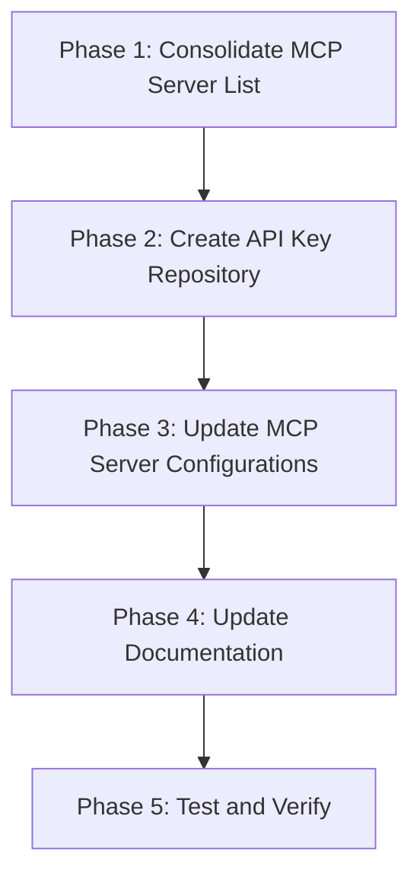
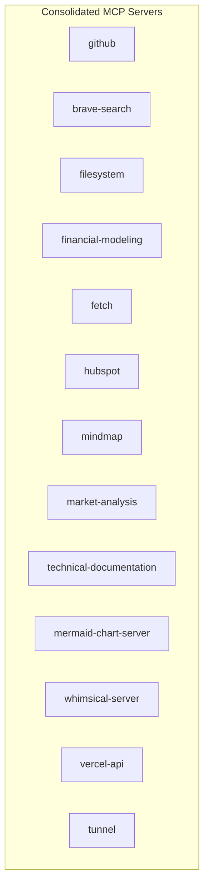
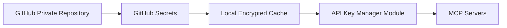
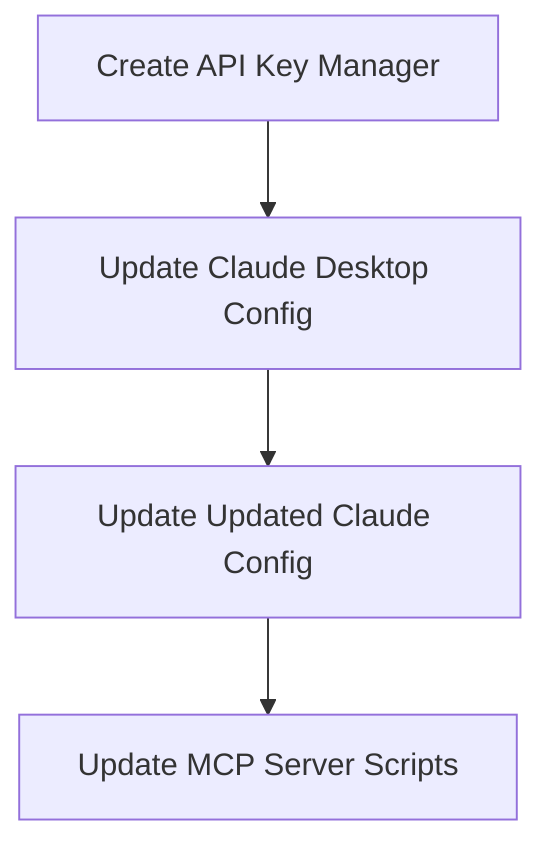
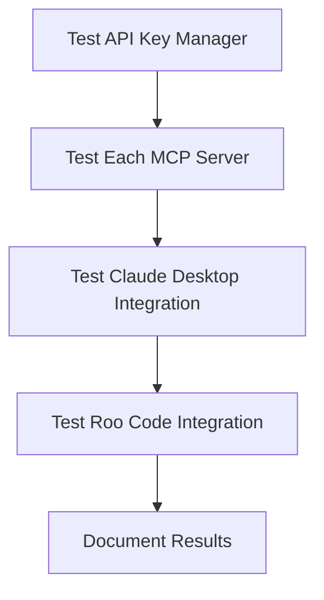

# MCP Server Alignment and API Key Repository Plan

## Executive Summary

This document outlines a comprehensive plan to:
1. Align and consolidate MCP server configurations across Claude Desktop and Roo Code
2. Create a secure, centralized API key repository using GitHub
3. Update all documentation to reflect the current state of MCP servers
4. Implement a robust testing and verification process

## Current State Analysis

Based on a thorough review of the existing configurations and documentation, we've identified several inconsistencies:

### MCP Servers in Claude Desktop Config
- github
- brave-search
- filesystem
- financial-modeling
- fetch
- hubspot
- mindmap
- market-analysis
- technical-documentation
- mermaid-chart-server
- whimsical-server
- vercel-api

### MCP Servers in Updated Claude Config
- github
- brave-search
- filesystem
- financial-modeling
- fetch
- mindmap
- market-analysis
- technical-documentation
- tunnel
- vercel-api

### MCP Servers in Setup Plan and Prompt
Focus only on:
- fetch
- mindmap
- market-analysis
- financial-modeling
- technical-documentation

### Key Issues Identified
1. Inconsistent server lists across configurations
2. API keys stored directly in configuration files (security risk)
3. Documentation does not reflect the current state
4. No centralized API key management

## Plan Overview



## Phase 1: Consolidate MCP Server List

### Comprehensive MCP Server Inventory

We will include all servers currently in use plus the tunnel server:



### Implementation Steps

1. **Create a consolidated server list**
   - Document all servers and their purposes
   - Identify required API keys for each server
   - Map server locations and configurations

2. **Standardize server naming conventions**
   - Ensure consistent naming across all configurations
   - Document any aliases or alternative names

3. **Identify server dependencies**
   - Map dependencies between servers
   - Document required environment variables

## Phase 2: Create API Key Repository

### GitHub-Based Secure Vault with Local Cache



### Implementation Details

1. **Create a Private GitHub Repository**
   - Repository name: `api-keys-vault`
   - Set to private with restricted access
   - Configure branch protection rules

2. **Set Up GitHub Secrets**
   - Store all API keys as GitHub repository secrets
   - Use naming convention: `SERVER_NAME_API_KEY`
   - Example: `GITHUB_API_KEY`, `BRAVE_SEARCH_API_KEY`

3. **Create Local Encrypted Cache**
   - Develop a utility to fetch secrets from GitHub and store locally
   - Use strong encryption for the local cache
   - Implement automatic refresh mechanism
   - Set appropriate file permissions

4. **API Key Manager Module**
   - Create a Node.js module to retrieve keys from local cache
   - Implement fallback to GitHub if cache is invalid
   - Add logging and monitoring for access attempts
   - Include error handling and retry logic

### GitHub Secrets Utility

```javascript
// github-secrets.js
const { Octokit } = require('@octokit/rest');
const { createAppAuth } = require('@octokit/auth-app');

const octokit = new Octokit({
  authStrategy: createAppAuth,
  auth: {
    appId: process.env.GITHUB_APP_ID,
    privateKey: process.env.GITHUB_PRIVATE_KEY,
    installationId: process.env.GITHUB_INSTALLATION_ID,
  },
});

async function getSecret(secretName) {
  try {
    const { data } = await octokit.actions.getRepoSecret({
      owner: 'jamcam-me',
      repo: 'api-keys-vault',
      secret_name: secretName,
    });
    
    return data.value;
  } catch (error) {
    console.error(`Error retrieving secret ${secretName}:`, error);
    throw error;
  }
}

module.exports = { getSecret };
```

### Local Cache Utility

```javascript
// local-cache.js
const fs = require('fs');
const path = require('path');
const crypto = require('crypto');

const CACHE_FILE = path.join(process.env.APPDATA, 'api-keys-cache.enc');
const ENCRYPTION_KEY = process.env.ENCRYPTION_KEY || 'default-encryption-key';

function encrypt(text) {
  const iv = crypto.randomBytes(16);
  const cipher = crypto.createCipheriv('aes-256-cbc', Buffer.from(ENCRYPTION_KEY), iv);
  let encrypted = cipher.update(text);
  encrypted = Buffer.concat([encrypted, cipher.final()]);
  return { iv: iv.toString('hex'), encryptedData: encrypted.toString('hex') };
}

function decrypt(text) {
  const iv = Buffer.from(text.iv, 'hex');
  const encryptedText = Buffer.from(text.encryptedData, 'hex');
  const decipher = crypto.createDecipheriv('aes-256-cbc', Buffer.from(ENCRYPTION_KEY), iv);
  let decrypted = decipher.update(encryptedText);
  decrypted = Buffer.concat([decrypted, decipher.final()]);
  return decrypted.toString();
}

function getFromCache(serverName) {
  try {
    if (!fs.existsSync(CACHE_FILE)) return null;
    
    const encryptedData = JSON.parse(fs.readFileSync(CACHE_FILE, 'utf8'));
    const decryptedData = decrypt(encryptedData);
    const cache = JSON.parse(decryptedData);
    
    return cache[serverName];
  } catch (error) {
    console.error(`Error reading from cache for ${serverName}:`, error);
    return null;
  }
}

function saveToCache(serverName, apiKey) {
  try {
    let cache = {};
    
    if (fs.existsSync(CACHE_FILE)) {
      const encryptedData = JSON.parse(fs.readFileSync(CACHE_FILE, 'utf8'));
      const decryptedData = decrypt(encryptedData);
      cache = JSON.parse(decryptedData);
    }
    
    cache[serverName] = apiKey;
    
    const encryptedCache = encrypt(JSON.stringify(cache));
    fs.writeFileSync(CACHE_FILE, JSON.stringify(encryptedCache));
    
    return true;
  } catch (error) {
    console.error(`Error saving to cache for ${serverName}:`, error);
    return false;
  }
}

module.exports = { getFromCache, saveToCache };
```

### API Key Manager

```javascript
// api-key-manager.js
const { getSecret } = require('./github-secrets');
const { getFromCache, saveToCache } = require('./local-cache');

async function getApiKey(serverName) {
  try {
    // Try to get from cache first
    const cachedKey = getFromCache(serverName);
    if (cachedKey) return cachedKey;
    
    // Fallback to GitHub
    const key = await getSecret(`${serverName.toUpperCase()}_API_KEY`);
    if (key) {
      saveToCache(serverName, key);
      return key;
    }
    
    throw new Error(`API key for ${serverName} not found`);
  } catch (error) {
    console.error(`Error retrieving API key for ${serverName}:`, error);
    throw error;
  }
}

module.exports = { getApiKey };
```

## Phase 3: Update MCP Server Configurations

### Configuration Update Process



### Implementation Steps

1. **Create API Key Manager**
   - Implement the utilities described above
   - Test with sample API keys
   - Document usage and error handling

2. **Update Claude Desktop Configuration**
   - Backup current configuration
   - Remove API keys from the configuration
   - Update to use API Key Manager
   - Example updated configuration:

```json
{
  "mcpServers": {
    "github": {
      "command": "node",
      "args": [
        "D:\\github\\Claude-MCP\\src\\mcp-servers\\github-server.js"
      ],
      "disabled": false,
      "autoApprove": []
    },
    "brave-search": {
      "command": "node",
      "args": [
        "D:\\github\\Claude-MCP\\src\\mcp-servers\\brave-search-server.js"
      ],
      "disabled": false,
      "autoApprove": []
    }
    // Other servers...
  }
}
```

3. **Update MCP Server Scripts**
   - Modify each server script to use the API Key Manager
   - Example updated server script:

```javascript
// github-server.js
const { getApiKey } = require('../utils/api-key-manager');

async function initializeServer() {
  try {
    const apiKey = await getApiKey('github');
    // Initialize server with the API key
    // ...
  } catch (error) {
    console.error('Failed to initialize GitHub server:', error);
    process.exit(1);
  }
}

initializeServer();
```

4. **Create Environment Setup Script**
   - Create a script to set up the necessary environment variables
   - Include instructions for first-time setup

```javascript
// setup-env.js
const fs = require('fs');
const path = require('path');
const readline = require('readline');
const crypto = require('crypto');

const rl = readline.createInterface({
  input: process.stdin,
  output: process.stdout
});

async function setup() {
  console.log('Setting up environment for API Key Manager...');
  
  // Generate encryption key
  const encryptionKey = crypto.randomBytes(32).toString('hex');
  
  // Get GitHub App credentials
  const githubAppId = await question('Enter GitHub App ID: ');
  const githubInstallationId = await question('Enter GitHub Installation ID: ');
  
  // Create .env file
  const envContent = `
ENCRYPTION_KEY=${encryptionKey}
GITHUB_APP_ID=${githubAppId}
GITHUB_INSTALLATION_ID=${githubInstallationId}
GITHUB_PRIVATE_KEY_PATH=./private-key.pem
  `.trim();
  
  fs.writeFileSync('.env', envContent);
  
  console.log('Environment setup complete. Please place your GitHub App private key in private-key.pem');
  rl.close();
}

function question(query) {
  return new Promise(resolve => {
    rl.question(query, resolve);
  });
}

setup();
```

## Phase 4: Update Documentation

### Documentation Updates

1. **Update MCP Server Setup Plan**
   - Add all current servers to the plan
   - Include API Key Manager setup instructions
   - Update directory structure to reflect reality
   - Add troubleshooting section

2. **Update MCP Server Setup Prompt**
   - Expand the list of servers to include all current servers
   - Add instructions for API key management
   - Update example implementations

3. **Update Claude Desktop Setup Instructions**
   - Include all current servers
   - Add instructions for API key management
   - Update troubleshooting section

4. **Create API Key Manager Documentation**
   - Document installation and setup
   - Include usage examples
   - Add security best practices

### Example Updated Setup Plan Section

```markdown
## MCP Server Configuration

The following MCP servers are currently configured:

1. **github** - GitHub API integration
2. **brave-search** - Brave Search API integration
3. **filesystem** - Local filesystem access
4. **financial-modeling** - Financial modeling tools
5. **fetch** - HTTP request capabilities
6. **hubspot** - HubSpot CRM integration
7. **mindmap** - Mindmap creation and management
8. **market-analysis** - Market analysis tools
9. **technical-documentation** - Technical documentation generation
10. **mermaid-chart-server** - Mermaid chart generation
11. **whimsical-server** - Whimsical diagram integration
12. **vercel-api** - Vercel API integration
13. **tunnel** - Ngrok tunnel management

Each server requires specific configuration and may need API keys. All API keys are managed through the API Key Manager.
```

## Phase 5: Test and Verify

### Testing Process



### Implementation Steps

1. **Test API Key Manager**
   - Verify key retrieval from GitHub
   - Verify local cache functionality
   - Test error handling and fallback mechanisms
   - Verify encryption and decryption

2. **Test Each MCP Server**
   - Verify each server can start with the new configuration
   - Test API key retrieval in each server
   - Verify functionality with Claude Desktop
   - Test error scenarios

3. **Test Claude Desktop Integration**
   - Verify Claude Desktop can start all servers
   - Test server functionality through Claude
   - Verify error handling and reporting

4. **Test Roo Code Integration**
   - Verify Roo Code can access all servers
   - Test server functionality through Roo Code
   - Verify error handling and reporting

5. **Document Results**
   - Create test report
   - Update documentation with any issues found
   - Create troubleshooting guide

### Test Cases

| Test Case | Description | Expected Result |
|-----------|-------------|-----------------|
| API Key Retrieval | Retrieve API key from GitHub | Key successfully retrieved |
| Cache Functionality | Retrieve API key from cache | Key retrieved without GitHub API call |
| Server Initialization | Initialize each MCP server | All servers start successfully |
| Claude Desktop Integration | Use servers through Claude Desktop | Servers accessible and functional |
| Roo Code Integration | Use servers through Roo Code | Servers accessible and functional |
| Error Handling | Test with invalid API key | Appropriate error message displayed |
| Security | Attempt to access API keys directly | Access denied |

## Implementation Timeline

| Phase | Duration | Dependencies |
|-------|----------|--------------|
| Phase 1: Consolidate MCP Server List | 1 day | None |
| Phase 2: Create API Key Repository | 2-3 days | Phase 1 |
| Phase 3: Update MCP Server Configurations | 2-3 days | Phase 2 |
| Phase 4: Update Documentation | 1 day | Phase 3 |
| Phase 5: Test and Verify | 1-2 days | Phase 4 |

Total estimated time: 7-10 days

## Security Considerations

1. **API Key Storage**
   - API keys are stored as GitHub Secrets
   - Local cache is encrypted
   - Access is restricted to authorized users

2. **Authentication**
   - GitHub App authentication is used
   - Private key is stored securely
   - Access tokens have limited scope

3. **Monitoring**
   - Access to API keys is logged
   - Failed attempts are reported
   - Regular security audits are performed

4. **Key Rotation**
   - Process for rotating API keys
   - Automatic cache invalidation
   - Minimal downtime during rotation

## Conclusion

This plan provides a comprehensive approach to aligning MCP server configurations and implementing a secure API key repository. By following this plan, we will:

1. Ensure consistency across all MCP server configurations
2. Improve security by centralizing and encrypting API keys
3. Update documentation to reflect the current state
4. Implement robust testing and verification processes

The end result will be a more secure, maintainable, and well-documented MCP server infrastructure.