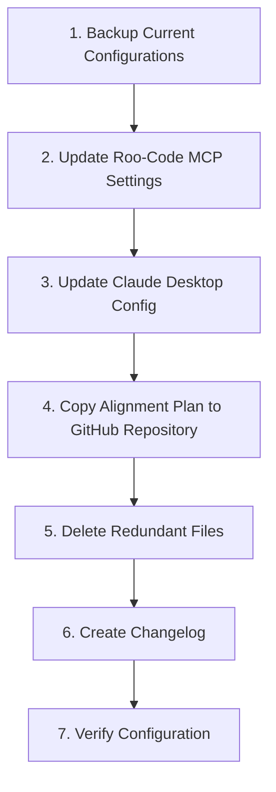

# MCP Server Centralization and Cleanup Plan

## Executive Summary

This document outlines a detailed plan to:
1. Centralize all MCP server configurations to only exist under `D:\github\Claude-MCP`
2. Update all configuration files to point to the centralized location
3. Consolidate documentation by keeping only the most comprehensive and up-to-date plan
4. Document all changes in a changelog

## Current State Analysis

### MCP Server Locations
- **Roo-Code MCP Settings**: Most servers point to `C:/Users/JamesCameron/Big Rock Intelligence/Apogee Insights - Documents/Planning/claude-mcp/src/mcp-servers/`
- **Claude Desktop Config**: Most servers already point to `D:/github/Claude-MCP/src/mcp-servers/`, except for:
  - mermaid-chart-server: `C:\\Users\\JamesCameron\\AppData\\Roaming\\Roo-Code\\MCP\\mermaid-chart-server\\build\\index.js`
  - whimsical-server: `C:\\Users\\JamesCameron\\AppData\\Roaming\\Roo-Code\\MCP\\whimsical-server\\build\\index.js`
- **GitHub Repository**: All necessary server files already exist in `D:/github/Claude-MCP/src/mcp-servers/`

### Documentation Files
- Three different MCP server setup/alignment plan files exist:
  - `D:\github\mcp-server-setup-prompt.md` (one-shot prompt)
  - `D:\github\mcp-server-setup-plan.md` (implementation plan)
  - `C:\Users\JamesCameron\Big Rock Intelligence\jamcam Inc. - General\jamcam Inc. Operations\IT\BRI_website\mcp-server-alignment-plan.md` (comprehensive alignment plan)
- The mcp-server-alignment-plan.md is the most comprehensive and up-to-date

## Implementation Plan



### 1. Backup Current Configurations

1. **Create backups of all configuration files**:
   - Backup Roo-Code MCP settings file:
     ```
     copy "c:/Users/JamesCameron/AppData/Roaming/Code/User/globalStorage/rooveterinaryinc.roo-cline/settings/mcp_settings.json" "c:/Users/JamesCameron/AppData/Roaming/Code/User/globalStorage/rooveterinaryinc.roo-cline/settings/mcp_settings.json.bak"
     ```
   - Backup Claude Desktop config file:
     ```
     copy "c:/Users/JamesCameron/AppData/Roaming/Claude/claude_desktop_config.json" "c:/Users/JamesCameron/AppData/Roaming/Claude/claude_desktop_config.json.bak"
     ```

### 2. Update Roo-Code MCP Settings

1. **Update all server paths in the Roo-Code MCP settings file**:
   - Change all paths from `C:/Users/JamesCameron/Big Rock Intelligence/Apogee Insights - Documents/Planning/claude-mcp/src/mcp-servers/` to `D:/github/Claude-MCP/src/mcp-servers/`
   - Ensure all environment variables and API keys are preserved
   - Example updated configuration for one server:
     ```json
     "financial-modeling": {
       "command": "node",
       "args": [
         "D:/github/Claude-MCP/src/mcp-servers/financial-modeling-server.js"
       ],
       "disabled": false,
       "alwaysAllow": [
         "scenario_analysis",
         "revenue_projection"
       ]
     }
     ```

### 3. Update Claude Desktop Config

1. **Update remaining server paths in the Claude Desktop config file**:
   - Update paths for mermaid-chart-server and whimsical-server to point to the GitHub location
   - Ensure all environment variables and API keys are preserved
   - Example updated configuration:
     ```json
     "mermaid-chart-server": {
       "command": "node",
       "args": [
         "D:\\github\\Claude-MCP\\src\\mcp-servers\\mermaid-chart-server.js"
       ]
     },
     "whimsical-server": {
       "command": "node",
       "args": [
         "D:\\github\\Claude-MCP\\src\\mcp-servers\\whimsical-server.js"
       ]
     }
     ```

### 4. Copy Alignment Plan to GitHub Repository

1. **Copy the comprehensive alignment plan to the GitHub repository**:
   - Source: `C:\Users\JamesCameron\Big Rock Intelligence\jamcam Inc. - General\jamcam Inc. Operations\IT\BRI_website\mcp-server-alignment-plan.md`
   - Destination: `D:\github\Claude-MCP\docs\mcp-server-alignment-plan.md`
   - This ensures the documentation is stored alongside the code

### 5. Delete Redundant Files

1. **Delete the following redundant files**:
   - `D:\github\mcp-server-setup-prompt.md`
   - `D:\github\mcp-server-setup-plan.md`
   - The original alignment plan can remain in its current location as a reference, but the GitHub copy will be the source of truth

### 6. Create Changelog

1. **Create a changelog file to document the changes**:
   - Path: `D:\github\Claude-MCP\docs\mcp-server-changelog.md`
   - Include details about:
     - Centralization of MCP server configurations
     - Updates to configuration files
     - Consolidation of documentation
     - Any issues encountered and their resolutions

### 7. Verify Configuration

1. **Test each MCP server to ensure it works correctly with the new paths**:
   - Start each server individually using the scripts in package.json
   - Verify that all servers can be accessed and used properly
   - Test with both Claude Desktop and Roo-Code
   - Document any issues encountered and their resolutions

## Success Criteria

- All MCP server configurations point to `D:/github/Claude-MCP/src/mcp-servers/`
- The comprehensive alignment plan is available in the GitHub repository
- Redundant files are removed
- All servers function correctly with the new configuration
- Changes are documented in the changelog

## Risks and Mitigations

| Risk | Mitigation |
|------|------------|
| API keys or environment variables might be lost during the update | Ensure all environment variables are preserved in the updated configuration |
| Some servers might not work with the new paths | Test each server thoroughly and fix any path-related issues |
| Missing server files in the GitHub location | Verify all necessary files exist before updating configurations |
| Disruption to ongoing work | Perform updates during a maintenance window |

## Timeline

| Task | Estimated Time |
|------|---------------|
| Backup Current Configurations | 15 minutes |
| Update Roo-Code MCP Settings | 30 minutes |
| Update Claude Desktop Config | 30 minutes |
| Copy Alignment Plan to GitHub Repository | 15 minutes |
| Delete Redundant Files | 15 minutes |
| Create Changelog | 30 minutes |
| Verify Configuration | 1-2 hours |
| **Total** | **3-4 hours** |