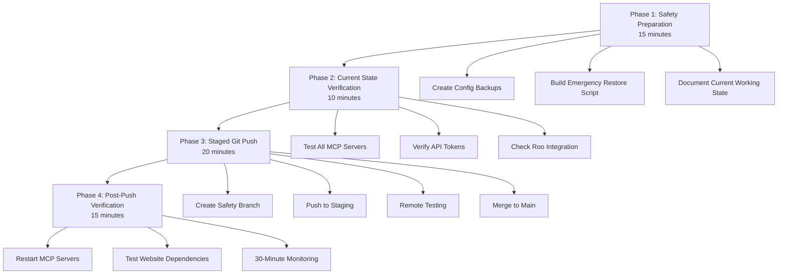

# Safe Git Push Plan - 510 Changes Protection Strategy

## Executive Summary

This plan ensures the safe deployment of 510 changes to the Claude-MCP repository while protecting the critical MCP server infrastructure that your website depends on. The github-server MCP is particularly critical and must remain operational throughout the process.

## Current State Analysis

### ✅ **Confirmed Working Components**
- **GitHub MCP Server**: Production ready at [`D:/github/Claude-MCP/src/mcp-servers/github-server/index.js`](src/mcp-servers/github-server/index.js:1)
- **Vercel MCP Server**: Functional at [`D:/github/Claude-MCP/src/mcp-servers/vercel-api-mcp.js`](src/mcp-servers/vercel-api-mcp.js:1)
- **MCP Configuration**: Centralized in [`package.json`](package.json:47) with 11 configured servers
- **Roo Integration**: Working with updated paths per [`docs/mcp-server-changelog.md`](docs/mcp-server-changelog.md:1)

### ⚠️ **Risk Assessment**

| Component | Risk Level | Impact | Mitigation |
|-----------|------------|---------|------------|
| GitHub MCP Server | 🟡 Low | Website breaks | Backup config + test script |
| Roo MCP Settings | 🟠 Medium | All MCP access lost | Full config backup |
| Environment Variables | 🔴 High | API access lost | Document + verify |
| Dependencies | 🟠 Medium | Runtime errors | Version compatibility check |

## Implementation Plan



## Phase 1: Safety Preparation (15 minutes)

### 1.1 Create Configuration Backups

**Critical Files to Backup:**
- `c:/Users/JamesCameron/AppData/Roaming/Code/User/globalStorage/rooveterinaryinc.roo-cline/settings/mcp_settings.json`
- `c:/Users/JamesCameron/AppData/Roaming/Claude/claude_desktop_config.json`
- `D:/github/Claude-MCP/package.json`
- All environment variables containing API tokens

**Backup Script:**
```bash
# Create backup directory with timestamp
BACKUP_DIR="./backups/$(date +%Y%m%d_%H%M%S)"
mkdir -p "$BACKUP_DIR"

# Backup Roo MCP settings
cp "c:/Users/JamesCameron/AppData/Roaming/Code/User/globalStorage/rooveterinaryinc.roo-cline/settings/mcp_settings.json" "$BACKUP_DIR/roo_mcp_settings.json"

# Backup Claude Desktop config
cp "c:/Users/JamesCameron/AppData/Roaming/Claude/claude_desktop_config.json" "$BACKUP_DIR/claude_desktop_config.json"

# Backup package.json
cp "./package.json" "$BACKUP_DIR/package.json"

# Document environment variables
echo "GITHUB_API_TOKEN=$GITHUB_API_TOKEN" > "$BACKUP_DIR/env_vars.txt"
echo "VERCEL_API_TOKEN=$VERCEL_API_TOKEN" >> "$BACKUP_DIR/env_vars.txt"
```

### 1.2 Emergency Restore Script

**File: `scripts/emergency-restore.sh`**
```bash
#!/bin/bash
set -e

LATEST_BACKUP=$(ls -1t backups/ | head -n 1)
BACKUP_DIR="backups/$LATEST_BACKUP"

echo "🚨 EMERGENCY RESTORE FROM: $BACKUP_DIR"

# Stop all MCP processes
echo "Stopping MCP processes..."
pkill -f "mcp-server" || true

# Restore configurations
echo "Restoring Roo MCP settings..."
cp "$BACKUP_DIR/roo_mcp_settings.json" "c:/Users/JamesCameron/AppData/Roaming/Code/User/globalStorage/rooveterinaryinc.roo-cline/settings/mcp_settings.json"

echo "Restoring Claude Desktop config..."
cp "$BACKUP_DIR/claude_desktop_config.json" "c:/Users/JamesCameron/AppData/Roaming/Claude/claude_desktop_config.json"

echo "Restoring package.json..."
cp "$BACKUP_DIR/package.json" "./package.json"

echo "✅ Emergency restore complete. Restart Roo and Claude Desktop."
```

### 1.3 Current State Documentation

**File: `docs/pre-push-state.md`**
```markdown
# Pre-Push State Documentation
Date: $(date)
Git Commit: $(git rev-parse HEAD)

## Working MCP Servers
- github-server: ✅ Operational
- vercel-server: ✅ Operational  
- brave-search-server: ✅ Operational
- filesystem-server: ✅ Operational
- fetch-server: ✅ Operational
- mindmap-server: ✅ Operational
- market-analysis-server: ✅ Operational
- financial-modeling-server: ✅ Operational
- technical-documentation-server: ✅ Operational

## Environment Variables
- GITHUB_API_TOKEN: [PRESENT]
- VERCEL_API_TOKEN: [PRESENT]

## Roo Integration Status
- All servers accessible: ✅
- Configuration paths correct: ✅
```

## Phase 2: Current State Verification (10 minutes)

### 2.1 MCP Server Health Check Script

**File: `scripts/test-mcp-servers.sh`**
```bash
#!/bin/bash

echo "🔍 Testing MCP Server Health..."

# Test GitHub Server
echo "Testing GitHub Server..."
timeout 10s npm run start:github > /dev/null 2>&1 && echo "✅ GitHub Server: OK" || echo "❌ GitHub Server: FAILED"

# Test Vercel Server  
echo "Testing Vercel Server..."
timeout 10s npm run start:vercel-server > /dev/null 2>&1 && echo "✅ Vercel Server: OK" || echo "❌ Vercel Server: FAILED"

# Test other critical servers
for server in brave-search filesystem fetch mindmap market-analysis financial-modeling technical-doc; do
    echo "Testing $server..."
    timeout 10s npm run start:$server > /dev/null 2>&1 && echo "✅ $server: OK" || echo "❌ $server: FAILED"
done
```

### 2.2 Environment Variable Verification

```bash
# Check critical environment variables
echo "🔑 Verifying Environment Variables..."
[ -n "$GITHUB_API_TOKEN" ] && echo "✅ GITHUB_API_TOKEN: Present" || echo "❌ GITHUB_API_TOKEN: Missing"
[ -n "$VERCEL_API_TOKEN" ] && echo "✅ VERCEL_API_TOKEN: Present" || echo "❌ VERCEL_API_TOKEN: Missing"
```

## Phase 3: Staged Git Push (20 minutes)

### 3.1 Safety Branch Strategy

```bash
# Create safety checkpoint
git checkout -b pre-push-safety-backup
git add .
git commit -m "Safety backup before 510 changes push"
git push origin pre-push-safety-backup

# Create staging branch for testing
git checkout main
git checkout -b staging-510-changes
git add .
git commit -m "Staging: 510 changes for safety testing"
git push origin staging-510-changes
```

### 3.2 Remote Testing Protocol

```bash
# Clone to temporary directory for testing
TEMP_DIR="/tmp/mcp-test-$(date +%s)"
git clone https://github.com/jamcam-me/claude-mcp.git "$TEMP_DIR"
cd "$TEMP_DIR"
git checkout staging-510-changes

# Test MCP servers in clean environment
npm install
./scripts/test-mcp-servers.sh

# If tests pass, safe to merge
if [ $? -eq 0 ]; then
    echo "✅ Remote tests passed - safe to merge"
else
    echo "❌ Remote tests failed - DO NOT MERGE"
    exit 1
fi
```

### 3.3 Merge Strategy

```bash
# Only merge if all tests pass
git checkout main
git merge staging-510-changes
git push origin main

# Tag the successful deployment
git tag -a "v$(date +%Y%m%d_%H%M%S)" -m "Safe deployment of 510 changes"
git push origin --tags
```

## Phase 4: Post-Push Verification (15 minutes)

### 4.1 MCP Server Restart Protocol

```bash
echo "🔄 Restarting MCP servers after push..."

# Restart Roo (if possible programmatically)
echo "Please restart Roo Code manually"

# Test each server individually
./scripts/test-mcp-servers.sh

# Verify Roo can access servers
echo "Please verify in Roo that all MCP servers are accessible"
```

### 4.2 Website Dependency Verification

```bash
echo "🌐 Testing website dependencies..."

# Test critical MCP operations that website depends on
# (This would be customized based on your specific website needs)

# Monitor for errors
echo "Monitor website for 30 minutes for any MCP-related errors"
```

## Emergency Procedures

### 🚨 If MCP Servers Break During Push

```bash
# IMMEDIATE RESPONSE
./scripts/emergency-restore.sh

# Restart applications
# 1. Close Roo Code
# 2. Close Claude Desktop  
# 3. Restart both applications
# 4. Test MCP server connectivity

# If still broken, rollback git
git checkout pre-push-safety-backup
git checkout main
git reset --hard pre-push-safety-backup
```

### 🔧 If Website Breaks But MCP Servers Work

1. **Isolate the issue**: Check if it's MCP-related or other dependencies
2. **Test MCP connectivity**: Verify servers respond correctly
3. **Check API tokens**: Ensure environment variables are still accessible
4. **Review recent changes**: Look for breaking changes in website code

## Success Criteria Checklist

- [ ] All MCP servers restart successfully
- [ ] Roo can access all configured MCP servers  
- [ ] GitHub server responds to test queries
- [ ] Vercel server responds to test queries
- [ ] Website functionality remains intact
- [ ] No runtime errors in MCP server logs
- [ ] Environment variables remain accessible
- [ ] No broken imports or dependencies

## Post-Deployment Monitoring

### First 30 Minutes
- [ ] Monitor MCP server logs for errors
- [ ] Test website functionality every 5 minutes
- [ ] Verify Roo integration remains stable

### First 24 Hours  
- [ ] Check for any delayed issues
- [ ] Monitor website performance
- [ ] Verify all API tokens remain valid

## Rollback Decision Matrix

| Issue | Severity | Action |
|-------|----------|--------|
| Single MCP server down | Low | Restart specific server |
| Multiple MCP servers down | High | Emergency restore |
| Roo can't access MCP | High | Emergency restore |
| Website completely broken | Critical | Emergency restore + git rollback |
| API tokens not working | Critical | Check environment + restore |

## Contact Information

- **Emergency Git Rollback**: `git reset --hard pre-push-safety-backup`
- **Emergency Restore**: `./scripts/emergency-restore.sh`
- **Test All Servers**: `./scripts/test-mcp-servers.sh`

---

**Prepared by**: Roo Architect Mode  
**Date**: 2025-06-03  
**Estimated Total Time**: 60 minutes  
**Risk Level**: Low (with full safety measures)